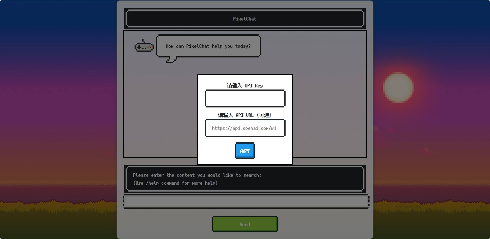
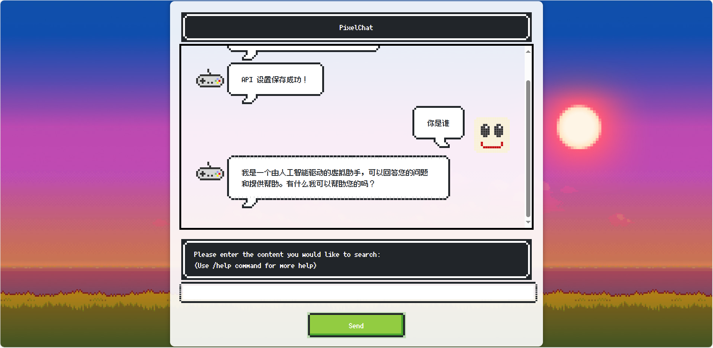
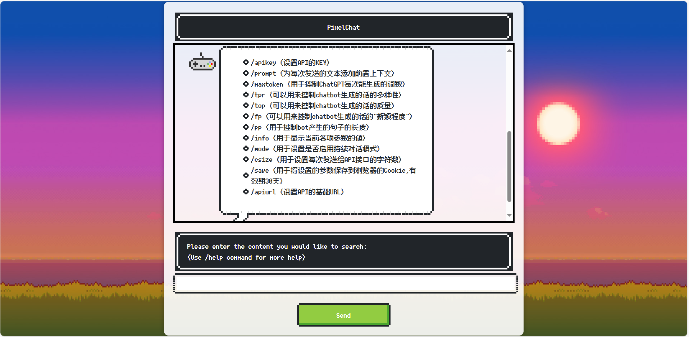

# PixelChat


PixelChat 是一个基于 OpenAI GPT-3.5 API 的像素风格聊天应用。它使用 NES.css 框架创建复古的像素艺术界面,为用户提供独特的聊天体验。







## 目录

- [特性](#特性)
- [快速开始](#快速开始)
- [使用指南](#使用指南)
- [命令列表](#命令列表)
- [项目结构](#项目结构)
- [常见问题](#常见问题)
- [贡献](#贡献)
- [许可证](#许可证)
- [致谢](#致谢)

## 特性

- 🎮 像素风格的用户界面,带来复古游戏般的体验
- 🤖 与 GPT-3.5 模型实时对话,获得智能回复
- 💻 支持代码高亮显示,方便技术讨论
- ⚙️ 可自定义 API 设置,灵活配置
- 📱 响应式设计,适配桌面和移动设备
- 🛠 支持多种命令,轻松管理对话设置

## 快速开始

1. 克隆此仓库到本地:
   ```bash
   git clone https://github.com/PixelPenguin01/PixelChat.git
   ```
2. 进入项目目录:
   ```bash
   cd PixelChat
   ```
3. 在浏览器中打开 `index.html` 文件
4. 首次使用时,您需要输入您的 OpenAI API 密钥
5. 开始与 AI 助手对话！

## 使用指南

1. **设置 API 密钥**: 首次使用时,系统会提示您输入 OpenAI API 密钥。您可以在 [OpenAI](https://openai.com/) 或 [free_chatgpt_api](https://github.com/popjane/free_chatgpt_api) 获取密钥。
2. **发送消息**: 在输入框中输入您的问题或命令,然后点击"Send"按钮或按回车键发送。
3. **使用命令**: 输入斜杠 `/` 开头的命令来管理设置。例如,`/help` 显示帮助信息。
4. **查看历史**: 滚动聊天窗口可以查看对话历史。
5. **自定义设置**: 使用命令调整各种参数,如温度、最大令牌数等。

## 命令列表

| 命令 | 描述 |
|------|------|
| `/help` | 显示帮助信息 |
| `/info` | 显示当前设置 |
| `/apikey` | 设置 API 密钥 |
| `/apiurl` | 设置 API URL |
| `/prompt` | 设置系统提示 |
| `/maxtoken` | 设置最大令牌数 |
| `/tpr` | 设置温度 |
| `/top` | 设置 top_p 值 |
| `/fp` | 设置频率惩罚 |
| `/pp` | 设置存在惩罚 |
| `/mode` | 设置对话模式 |
| `/csize` | 设置上下文大小 |
| `/save` | 保存设置 |

## 项目结构

```
PixelChat/
├── images/
│   ├── hero-min.jpg
│   └── cursor-edit.png
├── fonts/
│   ├── ja.woff2
│   ├── ko.woff2
│   ├── latin.woff2
│   ├── zh_hans.woff2
│   └── zh_hant.woff2
├── index.html
├── README.md
└── LICENSE
```

## 常见问题

1. **Q: 如何更新 API 密钥?**
   A: 使用 `/apikey` 命令,然后输入新的 API 密钥。

2. **Q: 能否使用其他 AI 模型?**
   A: 目前仅支持 GPT-3.5,未来可能会添加对其他模型的支持。

3. **Q: 聊天记录会保存吗?**
   A: 聊天记录仅保存在浏览器会话中,关闭页面后将丢失。

## 贡献

我们欢迎并感谢任何形式的贡献！以下是参与项目的方式:

1. Fork 本仓库
2. 创建您的特性分支 (`git checkout -b feature/AmazingFeature`)
3. 提交您的更改 (`git commit -m 'Add some AmazingFeature'`)
4. 推送到分支 (`git push origin feature/AmazingFeature`)
5. 开启一个 Pull Request

## 许可证

本项目采用 MIT 许可证 - 详情请见 [LICENSE](LICENSE) 文件。

## 致谢

- [free_chatgpt_api](https://github.com/popjane/free_chatgpt_api) - 提供免费 GPT-3.5 API
- [NES.css](https://github.com/nostalgic-css/NES.css) - 像素风格 CSS 框架
- [fusion-pixel-font](https://github.com/TakWolf/fusion-pixel-font) - 像素风格字体
- [Pixel-Portfolio-Webite](https://github.com/bearlike/Pixel-Portfolio-Webite) - 背景和编辑光标的参考
- [HTML-ChatGPT-3.js](https://github.com/sdsds222/HTML-ChatGPT-3.js/) - 数据传输逻辑的参考

---

如有问题或建议,请[开启一个 issue](https://github.com/PixelPenguin01/PixelChat/issues) 或联系 czx920718@gmail.com。

享受 PixelChat 带来的复古聊天体验吧! 🎮✨
